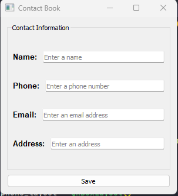

<!DOCTYPE html>
<html>

<body>

  <h1>PyQt5 Contact Book</h1>

  <p>This is a Python project using PyQt5 to create a simple Contact Book application. The application allows users to input contact information, including name, phone number, email, and address, and save it to a file ("mycontacts.txt").</p>

  <h2>About</h2>

  <p>The Contact Book application provides a user-friendly interface with input fields for each contact detail. It includes input validation for the phone number and email fields. Contacts are saved to a text file, and the application provides feedback on successful saving or any errors that may occur.</p>

  <h2>Screenshots</h2>

  

  <h2>How to Use</h2>

  <p>Run the Python script to launch the Contact Book application. Fill in the contact details in the respective fields and click the "Save" button to save the contact information to the "mycontacts.txt" file. Input validation ensures that correct phone numbers and email addresses are entered.</p>

  ```python
    python contact.py
  ```

  <h2>Dependencies</h2>

  <ul>
      <li>PyQt5</li>
  </ul>

  <h2>Contributing</h2>

  <p>Contributions are welcome! Feel free to open issues and pull requests to enhance the functionality or fix bugs.</p>

  <h2>License</h2>

  <p>This project is licensed under the MIT License - see the <a href="LICENSE">LICENSE</a> file for details.</p>

</body>

</html>
